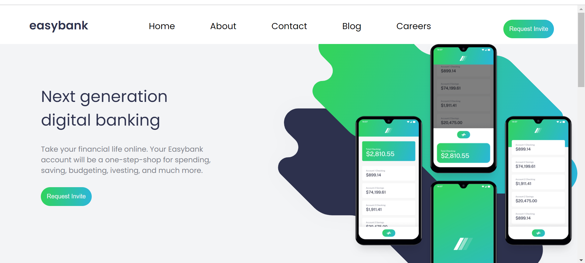
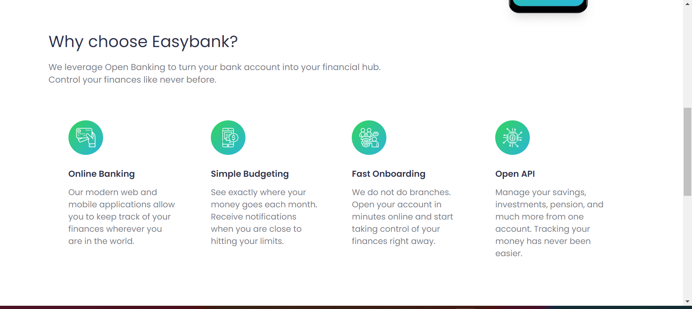
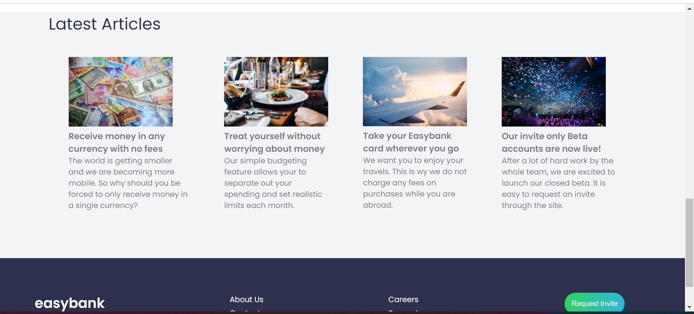
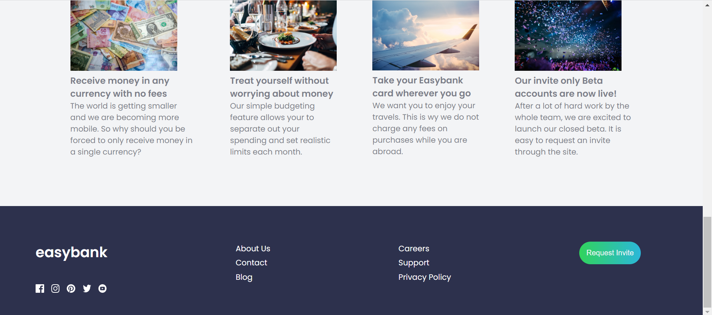

### The project

Inspired by the project that I found out at Frontend Mentor page (https://www.frontendmentor.io/challenges/easybank-landing-page-WaUhkoDN), this is a bank landing page. In this challenge, I´m working with HTML, CSS, and also JavaScript. 

### Screenshot

### Links

- Solution URL: ()

## My process

### Built with

- Semantic HTML5 markup
- CSS custom properties
- Flexbox
- CSS Grid

### What I learned

## Author

- LinkedIn - (https://www.linkedin.com/in/kadidja-toure-pukki-7b4b976b/)
